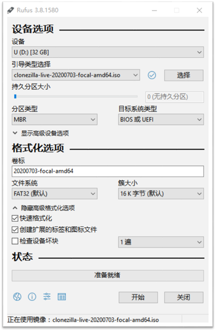
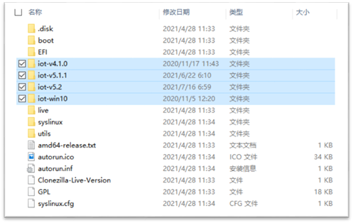

# IOT EDGE部署配置手册

## 制作恢复优盘

1. 软件及系统镜像准备

   > 注：以下软件和系统镜像均可在 <a href="https://pan.baidu.com/s/1GZUCiqoTC3F4mAUVuYkgDw" target='_blank'>百度网盘</a>下载，提取码：1234 

   * 下载再生龙，得到一个iso文件。*也可从<a href="http://clonezilla.nchc.org.tw/clonezilla-live/download/" target="_blank">官方下载</a>*

   

   * 下载rufus，便携版无需安装。*也可从<a href="http://rufus.ie/zh/" target="_blank">官方下载</a>*

   

   * 下载系统镜像，一个镜像即为一个文件夹，可下多个镜像，恢复时可自由选择系统。

   

2. 开始制作

   插入优盘，打开rufus，镜像选择 `clonezilla***.iso`，其它按默认即可制作一个启动优盘。

   

   完成后将需要的 `系统镜像文件夹` 拷贝到优盘根目录中。最终优盘内容大概如下：

   

   选中的几个文件夹都是系统镜像，优盘中可放多个镜像。做系统时可选择要恢复的系统。

   之后系统更新只需拷入文件夹即可。也可直接删除文件夹，清理过时不用的系统。

## 恢复系统

1. 使用恢复优盘恢复系统

   > 恢复后的硬盘可作为母盘。此方式也适用于小量的部署，避免拆机

   将优盘插上EDGE，BIOS设置为优盘启动，启动后建议选择菜单第二项进入，较为稳定。

   之后根据提示，将系统恢复到硬盘。

   恢复完成后拔出优盘，BIOS恢复设置为硬盘启动。

2. 使用硬盘克隆机恢复系统

   > 适合大量灌系统，需要母盘，需要拆卸硬盘

   将母盘克隆到其它硬盘，再分别插入EDGE即可得到一致的系统

## 初始化配置

> 最主要的功能是：为每台机器配置不同的IP，创建许可。

1. 开机，登录系统或使用SSH连接。

2. 输入g init初始化系统。根据提示有三种选择：

   【 1. 英文命令行（支持SSH和显示器） 2. 中文命令行（支持SSH和显示器） 3.图形界面（支持显示器） 】

   有显示器建议选择3，这种配置最简单。

   SSH连接选择2，将出现中文命令行配置菜单。

## 镜像版本历史

> 使用命令 imgver 将显示系统镜像的版本，如果提示命令错误，则表示是一个非常早期的版本，v4.0之后的版本均支持显示版本。由于版本向下兼容，未广泛使用的版本不提供下载。

* POC
  
  * 仅在ubuntu18.04.2上安装.net core。手工安装，无镜像包
* v1
  
  * 集成docker.io
* v2
  
  * 集成 azure组件，docker.io更换为moby
* v3
  
  * 集成外接显卡 `GeForce RTX 2060` 驱动
* v4
  * v4.0.0
    * 集成`wvdial:i386`拨号程序及基础配置
    * 支持`imgver`查看镜像版本
    * `/var/lib/docker`文件夹使用软链接到`/home/pi/var/docker`，解决增加容器空间不足的问题
    * 修复部分机器开机等待网络时间过长的问题
  * v4.0.1
    * 分区改为2个
  * v4.0.2
    * 集成压测软件stress
  * v4.1
    * 集成广和通5G模块驱动
* v5
  * v5.0
    * 添加桌面
    * 升级5G模块驱动，无需链接docker文件夹
    * 升级内核到5.4，支持wifi6
  * v5.1
    * 集成iotinit初始化工具（桌面）
    * 设置默认DNS（for kafka）
  * v5.1.1

    * iotinit支持中英文
  * v5.2

    * iotinit支持命令行
  * v5.3
    * 升级tools，支持使用证书认证连接kafka
    * 升级docker基础image：gitis/iot:1.1，增加秤采集需要的组件
    * 集成docker-compose，支持德国容器的启动方式
    * 集成frpc，以备远程调试使用

工业和信息化部备案管理系统网站 <a href="http://beian.miit.gov.cn/" target="_blank">辽ICP备18017601号-1</a>